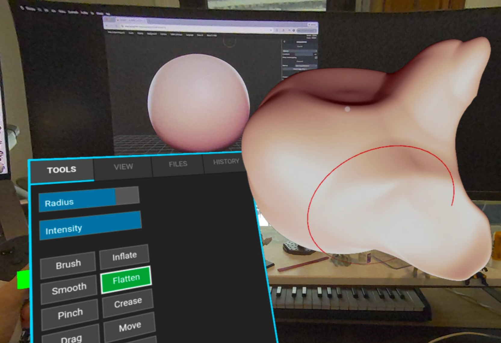

# SculptGL - VR Enhanced Fork

## Status
**Active Development**: This is a fork of [SculptGL](http://stephaneginier.com/sculptgl) focused on adding WebXR capabilities, specifically a VR Menu system.
(The original project is no longer actively maintained by the author).

**[Try the Live VR Build Here](https://tokeru.com/sculptgl-vr/)**


*SculptGL running on desktop, with SculptGL-VR running natively on a Quest 3 in foreground in AR/passthrough mode.*

## Supported platforms
It should work on any WebXR compatible device. So far I've tested on

- Quest 2 native browser
- Quest 3 native browser
- Google Chrome on Windows PCVR via Meta Link and Quest 3


## WebXR Features (What works)
- **Core VR/AR**:
    - Works in PCVR (accessible via Meta Link/Air Link).
    - **Native Quest 2/3 Support**: Includes AR Passthrough mode (select it from the view menu, there's a noticable pause/glitch when it swaps)
    - Render ported to webXR
- **Interaction**:
    - **VR Tablet Menu**: UI moved to a palette on the left controller
    - **Two-Handed Navigation**:
        - Single Grip: Translate world, rotate around controller
        - Double Grip: Scale and Rotate world from midpoint of controllers
    - Ray-casting support for UI interaction
- **Sculpting & Rendering**:
    - Most brushes are fully functional
    - Undo/Redo supported
    - Rendering modes: Matcap, PBR, Wireframe, Flat Shading
    - Brush Indicator (Cursor) restored in VR
    - symmetry
    - Export OBJ (will save to Downloads)
    - Import OBJ (will jump out of fullscreen mode and open a file browser)
    - Dynamic Topology (Experimental)

## Todo
- [ ] Multiresolution Not yet supported in VR
- Multiresolution Not yet supported in VR
- No UI to switch between Matcaps or PBR environments yet
- Cannot add new primitives or import meshes in VR
- Controllers are represeted with cubes, should replace with something better
- Menu draws over controllers, it should correctly place itself in depth against controllers/the smesh
- Double handed grip needs work, gets hard to control when the world has been scaled too large
- Two-handed-grip pivot point needs an overlay icon, not the current purple cube
- Cursor on menu feels laggy; could that run at a higher frame rate?
- Visual indicator for 'click' buttons like undo/redo
- Using symmetry near the mirror plan causes issues, easy to lose overall symmetry
- Matcap misaligned, feels like its lit from below
- Menu layout is clunky
- Map shortcuts to other buttons, eg thumbstick for undo/redo
- Voxel brush


## Long Term Goals / Vision
To eventually rewrite this project so it can coexist properly with upstream SculptGL. The current VR implementation is a "hard fork" with significant divergence in the core `Scene.js` logic.

**The Dream Goal:**
- Seamless Desktop <-> VR Switching.
- A "Start XR" button in the standard desktop UI.
- Putting on the headset transitions to the VR interface (hand palette etc).
- Taking off the headset returns immediately to the desktop interface.

*Note: This likely requires a clean fork/rewrite where the VR functionality is injected as a modular "plugin" rather than replacing the core application loop.*

## Quick Start
1. Install dependencies:
   ```bash
   yarn
   ```
2. Run development server:
   ```bash
   yarn dev
   ```
3. Visit `http://localhost:8000` (or the URL provided).

Alternatively, you can use Python for a simple static server if you have built the source or are running pre-built files:
```bash
python3 -m http.server 8000
```

## Original Project Resources
- Live Demo: [stephaneginier.com/sculptgl](http://stephaneginier.com/sculptgl)
- Website: [stephaneginier.com](http://stephaneginier.com/)

## Tools
Node.js is required.

### Standalone Build
```bash
yarn add electron
yarn add electron-packager
yarn standalone
```

## Credits
- Original SculptGL by [Stéphane Ginier](http://stephaneginier.com/).
- Raw environments from [HDRI Haven](https://hdrihaven.com/hdris).

## Dev Process / Background

This port/proof of concept was done using **[Google Gemini / Antigravity](https://antigravity.google/)** over a weekend. 

My day job is a 3D artist; while I can do VEX and Python OK, and read/write a little bit of JavaScript, tackling a full port like this was totally beyond me. I had a vague understanding of how this port was going to have to be broken down into steps, and it pretty much went as intended. Most of this was short bursts of time between housework and family things, I'd estimate maybe 8 hours in total. 

**Rough Timeline:**

Saturday:
- Send something, anything to VR mode.
- Deal with scale issues (SculptGL default scale is huge in VR).
- Get cubes as controller representations.
- Get basic surface interaction working (this was mildly tricky as it was essentially totally replacing SculptGL's screen-based system with VR selection/interaction).
- Get both controllers working.
- Get brush interaction stable and intuitive.
- Fix shading (was weirdly posterised; turns out it was a high dynamic range RGBE thing where 'E' was exposure, not being translated properly into VR).
- Solve world scaling and rotation (lots of iteration here).
- Brush indicator working.

Sunday:
- Menu system: lots of testing here to add a palette on one hand, port over the various buttons SculptGL uses.
- Then mild disaster as a Meta update stopped PCVR working, which meant moving to native Quest 3.
- To my surprise native Quest 3 browser worked without a hitch!
- Then got AR passthrough working (apparently a single line of code).
- Fixed shader issues with world scale (normals were being incorrectly scaled as the world scaled).

Monday evening
- Fix world scale issues again: as the world scaled, the controllers or mesh would fly away (pivots for scaling were really weird).
- Bring rest of SculptGL menus over.
- Fix Undo/Redo (needed some careful poking through the code to see how SculptGL was updating mesh states directly to the GPU).
- Tidy up, publish to github.

The actual interaction with Antigravity was pretty conversational, eg 'ok, the lighting is looking strange when i scale, as the world scales up, the colours go dark, like a gamma crush.. what could it be?' we'd interact, it would ask me to debug, report stuff from the console, it would publish a change, I'd report back.

I had one disaster when I asked it too broad a request 'ok, add menus now', it broke the codebase and took effort to restore, but now I know to be more fine grained in my requests.

I haven't dared look at the code, maybe its all AI slop. One day I'll have a closer look. I'm quietly hoping that because this works on desktop chrome webXR, and on quest 3 with no changes, it'll also work for androidXR and AVP (assuming you have controllers).

Anyway, was a fun project, I hope to find time to finish of the last few things.
